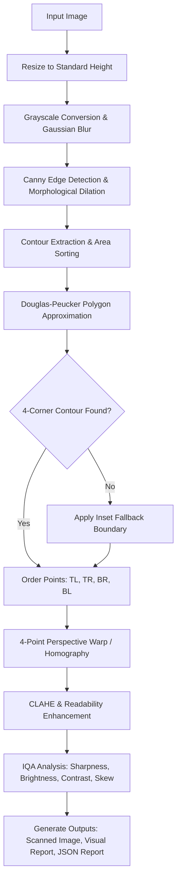

# DocuVision: Automatic Document Scanner and Quality Analyzer

[](https://www.python.org/)
[](https://opencv.org/)
[](https://numpy.org/)
[](https://python-pillow.org/)
[](tests/)
[]()

---

### 🎓 Academic Submission & Student Details

| Field | Information |
| :--- | :--- |
| **Student Name** | **Abhiral Jain** |
| **Registration Number** | **24BAI10677** |
| **Course** | Computer Vision |
| **Project Area** | Classical Digital Image Processing & Document Analysis |
| **GitHub Repository** | [https://github.com/AbhiralJain07/Computer-Vision-24BAI10677](https://github.com/AbhiralJain07/Computer-Vision-24BAI10677) |

---

## 📌 1. Project Introduction & Problem Statement

When users take photos of physical documents (receipts, notes, official forms, certificates) using smartphones, the resulting images typically suffer from:
1. **Perspective Distortion (Keystoning)** caused by taking photos at an angle.
2. **Uneven Lighting, Glare, and Shadow Casts** across the page.
3. **Irrelevant Cluttered Backgrounds** (desks, hands, surfaces).
4. **Motion Blur or Defocus** degrading text legibility.

### 💡 The Solution: DocuVision
**DocuVision** is an automated Classical Computer Vision system that transforms raw, skewed document photos into clean, flat, high-contrast digital scans. Furthermore, it performs an objective **Image Quality Assessment (IQA)** evaluating sharpness, brightness, contrast, and skew to inform the user whether the scan is legible or requires recapture.

```
+--------------------------+        +---------------------------+        +--------------------------+
|       Input Photo        |  --->  |    DocuVision Pipeline    |  --->  |      Final Artifacts     |
| (Tilted, Shadow, Clutter)|        | (Detect -> Warp -> Enhance|        | (Clean Scan + Metrics)   |
+--------------------------+        +---------------------------+        +--------------------------+
```

---

## ✨ 2. Key Features

- 🔍 **Automated Edge & Contour Extraction**: Uses Gaussian filtering, Canny edge detection, morphological dilation, and Ramer-Douglas-Peucker polygon approximation to locate the 4 corners of the document.
- 📐 **Homography Perspective Rectification**: Computes a $3 \times 3$ transformation matrix to unwarp the detected quadrilateral into an upright, orthogonal rectangle with preserved aspect ratio.
- ⚡ **Adaptive Contrast Enhancement**: Applies Contrast Limited Adaptive Histogram Equalization (CLAHE) and adaptive Gaussian thresholding to maximize text clarity without blowing out highlights.
- 📊 **Quantitative Quality Assessment (IQA)**:
  - **Sharpness**: Variance of Laplacian ($\sigma^2_{\nabla^2}$) for blur detection.
  - **Brightness**: Mean luminance calculation ($\mu_I$).
  - **Contrast**: Standard deviation / dynamic range metric ($\sigma_I$).
  - **Skew Angle**: Hough transform / minimum area bounding box orientation.
- 🖥️ **Dual Interface Support**:
  - **Interactive Web UI**: Drag-and-drop dashboard with real-time feedback and direct downloads.
  - **Headless CLI**: High-performance batch command-line interface.
- 🛡️ **Graceful Fallback**: If an image lacks clear boundaries, an intelligent fallback boundary prevents failure and outputs an enhanced cropped version.

---

## 🔄 3. Computer Vision Pipeline Architecture



---

## 📂 4. Project Directory Structure

```text
Computer-Vision-24BAI10677/
├── src/
│   └── docuvision/
│       ├── __init__.py         # Package initialization
│       ├── cli.py              # CLI entry point and pipeline orchestrator
│       ├── config.py           # Central configuration thresholds and settings
│       ├── io_utils.py         # Safe image read/write and aspect-ratio resizing
│       ├── preprocessing.py    # Edge detection, CLAHE, adaptive thresholding
│       ├── scanner.py          # Contour sorting & 4-point perspective warp
│       ├── quality.py          # Blur, brightness, contrast, & skew algorithms
│       ├── report.py           # Multi-panel visualization & JSON report writer
│       └── web.py              # Lightweight HTTP server & browser UI
├── scripts/
│   └── generate_sample.py      # Synthetic test image generator
├── tests/
│   └── test_docuvision.py      # Automated unit tests for CV functions
├── docs/
│   ├── project_report.md       # Full academic project report
│   └── diagrams/               # Architecture, workflow, and sequence diagrams
├── samples/
│   └── sample_document.jpg     # Default sample test document
├── outputs/                    # Auto-created directory for processed scans
├── main.py                     # Unified master runner
├── pyproject.toml              # Build specification and package metadata
├── requirements.txt            # Python dependencies
└── README.md                   # Project documentation
```

---

## 🛠️ 5. Prerequisites & System Requirements

- **Python**: Version 3.10 or newer (tested on Python 3.10, 3.11, 3.12, 3.13)
- **Supported Operating Systems**:
  - macOS (Apple Silicon M1/M2/M3/M4 and Intel)
  - Linux (Ubuntu, Debian, Fedora, Arch)
  - Windows 10 / 11
- **Package Managers**: `pip` or `conda`

---

## 🚀 6. Step-by-Step Installation & Setup

### Step 1: Clone the Repository
```bash
git clone https://github.com/AbhiralJain07/Computer-Vision-24BAI10677.git
cd Computer-Vision-24BAI10677
```
*(If you already have the folder downloaded, open your Terminal / Command Prompt and `cd` into the project directory).*

---

### Step 2: Environment Setup & Activation

Choose the instructions for your operating system and environment:

#### 🍎 For macOS / Linux (Option A: Using Conda - Recommended if terminal shows `(base)`)
```bash
# Install dependencies into your active environment
pip install -r requirements.txt
pip install -e .
```

#### 🍎 For macOS / Linux (Option B: Using Standard Python Virtual Environment)
```bash
# 1. Create a virtual environment
python3 -m venv .venv

# 2. Activate the virtual environment
source .venv/bin/activate

# 3. Upgrade pip and install dependencies
pip install --upgrade pip
pip install -r requirements.txt
pip install -e .
```

#### 🪟 For Windows (PowerShell or Command Prompt)
```powershell
# 1. Create a virtual environment
python -m venv .venv

# 2. Activate the virtual environment
.venv\Scripts\activate

# 3. Install dependencies
python -m pip install --upgrade pip
python -m pip install -r requirements.txt
python -m pip install -e .
```

---

## ⚙️ 7. Configuration (`src/docuvision/config.py`)

All core thresholds and parameters are centrally managed in `src/docuvision/config.py`. You can modify these values or pass custom dataclasses during runtime:

### Scanner Settings (`ScannerConfig`)
| Parameter | Default | Description |
| :--- | :--- | :--- |
| `resize_height` | `900` | Normalized working height (px) for consistent edge detection |
| `blur_kernel` | `5` | Gaussian blur kernel size $(5 \times 5)$ for noise suppression |
| `canny_low` | `50` | Lower hysteresis threshold for Canny edge detector |
| `canny_high` | `160` | Upper hysteresis threshold for Canny edge detector |
| `min_document_area_ratio` | `0.18` | Minimum contour area fraction relative to image frame |
| `output_width` | `900` | Target horizontal resolution of the scanned document |
| `binary_block_size` | `31` | Neighborhood size for adaptive Gaussian thresholding |
| `binary_c` | `12` | Constant subtracted from mean in adaptive thresholding |

### Quality Thresholds (`QualityThresholds`)
| Parameter | Default | Description |
| :--- | :--- | :--- |
| `min_sharpness` | `45.0` | Minimum Laplacian variance ($\sigma^2_{\nabla^2}$) required to pass blur check |
| `min_contrast` | `35.0` | Minimum standard deviation ($\sigma_I$) required for acceptable dynamic range |
| `min_brightness` | `70.0` | Minimum mean grayscale intensity ($\mu_I$) to avoid underexposure |
| `max_brightness` | `245.0` | Maximum mean grayscale intensity ($\mu_I$) to prevent glare/overexposure |
| `max_skew_degrees` | `8.0` | Maximum allowed residual skew angle ($^\circ$) before flagging tilt |

---

## 🎮 8. Step-by-Step Execution Guide

### Method 1: Interactive Web Dashboard (Recommended)

Start the local server with one command:

```bash
# macOS / Linux
python3 main.py

# Windows (or active Conda)
python main.py
```

1. Open your web browser (Safari, Chrome, Firefox, Edge) and visit:  
   👉 **`http://127.0.0.1:8000`**
2. **Drag and drop** or click to choose an image (`.jpg`, `.jpeg`, `.png`, `.webp`, `.bmp`, `.tiff`).
3. Click **Run Scanner**.
4. The dashboard will instantly display:
   - **Scanned Document**: Rectified, perspective-corrected output image.
   - **Quality Metrics Box**: Numerical values for Brightness, Contrast, Sharpness, Skew, and diagnostic verdict (**PASS** or **REVIEW**).
   - **Visual Report**: Multi-stage pipeline grid.
5. Click the **Download** buttons to save the scanned image, visual report, or JSON report.

---

### Method 2: Command-Line Interface (CLI)

#### A. Run with the Built-in Sample Document:
```bash
# macOS / Linux
python3 main.py --cli

# Windows
python main.py --cli
```

#### B. Process Any Custom Document Photo:
```bash
python3 main.py --cli --input /path/to/your_photo.jpg
```

#### C. Specify a Custom Output Directory:
```bash
python3 main.py --cli --input /path/to/your_photo.jpg --output-dir my_scans
```

---

### Method 3: Automated Unit Testing

To verify all computer vision modules, perspective transforms, and metric calculations:

```bash
python3 -m unittest discover -s tests
```

Expected output:
```text
.....
----------------------------------------------------------------------
Ran 5 tests in 0.098s

OK
```

---

## 📊 9. Understanding Generated Output Files

After processing an image (via Web UI or CLI), results are saved in the `outputs/` directory:

| Output Artifact | Format | Description |
| :--- | :--- | :--- |
| `outputs/scanned_document.png` | PNG | The primary perspective-corrected, contrast-enhanced document scan. |
| `outputs/visual_report.png` | PNG | A $2 \times 2$ visualization panel comparing: (1) Original Image, (2) Canny Edges, (3) Detected Document Boundary, (4) Final Scan. |
| `outputs/quality_report.json` | JSON | Machine-readable metrics containing numerical values and human-readable diagnostic messages. |

### Sample `quality_report.json`:
```json
{
  "brightness": 164.82,
  "contrast": 68.41,
  "sharpness": 384.15,
  "skew_degrees": -0.84,
  "passed": true,
  "messages": []
}
```

---

## 🔬 10. Computer Vision Algorithms Explained

### 1. Document Edge & Boundary Detection
- **Grayscale Conversion & Gaussian Blur**: Suppresses high-frequency camera sensor noise using a $5 \times 5$ Gaussian kernel ($G_\sigma(x, y)$).
- **Canny Edge Detection**: Identifies intensity gradients using Sobel operators, non-maximum suppression, and hysteresis thresholding ($T_{\text{low}}=50, T_{\text{high}}=160$).
- **Morphological Dilation**: Bridges small breaks in document edges.
- **Ramer-Douglas-Peucker Approximation**: Simplifies the largest closed contour into a polygon using an epsilon threshold $\epsilon = 0.02 \times \text{Perimeter}$. If the polygon has exactly 4 vertices and exceeds the minimum area ratio, it is selected as the document quadrilateral.

### 2. Four-Point Perspective Correction (Homography)
- The 4 detected points are sorted into clockwise order: **Top-Left**, **Top-Right**, **Bottom-Right**, and **Bottom-Left**.
- The physical width and height of the document are estimated via Euclidean distance norms ($L_2$):
  $$W = \max\left(\|\text{BR} - \text{BL}\|_2, \|\text{TR} - \text{TL}\|_2\right), \quad H = \max\left(\|\text{TR} - \text{BR}\|_2, \|\text{TL} - \text{BL}\|_2\right)$$
- An inverse perspective transformation matrix $M$ is derived via `cv2.getPerspectiveTransform` and applied via `cv2.warpPerspective` to generate a flat, rectangular image.

### 3. Readability & Contrast Enhancement
- **CLAHE (Contrast Limited Adaptive Histogram Equalization)**: Operates on local tiles ($8 \times 8$) with contrast limiting to prevent noise over-amplification in dark or bright corners.
- **Adaptive Gaussian Thresholding**: Computes localized threshold values to produce crisp, binarized text even under directional shadows.

### 4. Image Quality Assessment (IQA)
- **Sharpness Metric**: Computed as the variance of the 2D Laplacian operator:
  $$\text{Sharpness} = \text{Var}\left(\nabla^2 I\right) = \frac{1}{N} \sum (L(x, y) - \bar{L})^2$$
  *Low variance indicates blurred edges and poor camera focus.*
- **Brightness Metric**: Mean pixel intensity ($\mu_I = \frac{1}{N}\sum I(x, y)$).
- **Contrast Metric**: Standard deviation of pixel luminance ($\sigma_I$).
- **Skew Metric**: Hough Line Transform gradient median calculation to detect angular misalignment.

---

## ❓ 11. Troubleshooting & FAQs

### Q1: `ModuleNotFoundError: No module named 'cv2'`
- **Cause**: The Python environment running the script does not have `opencv-python` installed, or the virtual environment is not activated.
- **Fix**: Make sure your environment is activated (`source .venv/bin/activate` or active Conda) and run:
  ```bash
  pip install -r requirements.txt
  ```

### Q2: Port 8000 is already in use (`Address already in use`)
- **Fix**: Launch the web server on a different port using the `--port` flag:
  ```bash
  python3 main.py --port 8080
  ```
  Then open `http://127.0.0.1:8080`.

### Q3: Python 3.13 `cgi` module error
- **Fix**: PEP 594 removed the `cgi` module in Python 3.13. DocuVision's web server uses Python's standard `email.parser.BytesParser` to ensure full compatibility with Python 3.10, 3.11, 3.12, and 3.13+.

---

## 📚 12. References & Academic Citations

1. **Canny, J.** (1986). *A Computational Approach to Edge Detection.* IEEE Transactions on Pattern Analysis and Machine Intelligence, 8(6), 679–698.
2. **Douglas, D. H., & Peucker, T. K.** (1973). *Algorithms for the reduction of the number of points required to represent a digitized line or its caricature.* Cartographica: The International Journal for Geographic Information and Geovisualization, 10(2), 112–122.
3. **Hartley, R., & Zisserman, A.** (2004). *Multiple View Geometry in Computer Vision.* Cambridge University Press.
4. **Pizer, S. M., et al.** (1987). *Adaptive histogram equalization and its variations.* Computer Vision, Graphics, and Image Processing, 39(3), 355–368.
5. **Gonzalez, R. C., & Woods, R. E.** (2018). *Digital Image Processing (4th Edition).* Pearson.
6. **OpenCV Open Source Computer Vision Library**: [https://docs.opencv.org/](https://docs.opencv.org/)

---

## 👤 13. Author & Contact

- **Author:** Abhiral Jain
- **Registration Number:** `24BAI10677`
- **Course:** Computer Vision
- **GitHub:** [@AbhiralJain07](https://github.com/AbhiralJain07)
- **Repository Link:** [https://github.com/AbhiralJain07/Computer-Vision-24BAI10677](https://github.com/AbhiralJain07/Computer-Vision-24BAI10677)
