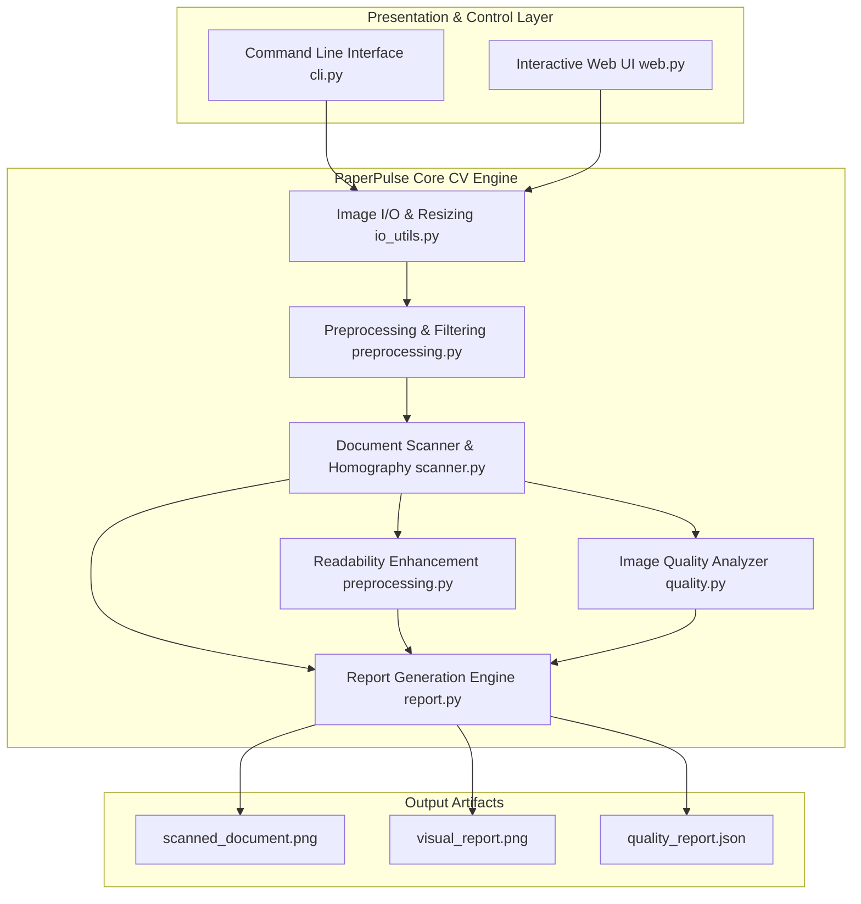

# System Architecture Diagram

```mermaid
flowchart TD
    subgraph Presentation_Layer [Presentation & Control Layer]
        CLI[Command Line Interface cli.py]
        WEB[Interactive Web UI web.py]
    end

    subgraph Core_Pipeline [PaperPulse Core CV Engine]
        IO[Image I/O & Resizing io_utils.py]
        PRE[Preprocessing & Filtering preprocessing.py]
        SCAN[Document Scanner & Homography scanner.py]
        ENH[Readability Enhancement preprocessing.py]
        IQA[Image Quality Analyzer quality.py]
        REP[Report Generation Engine report.py]
    end

    subgraph Data_Artifacts [Output Artifacts]
        OUT_IMG[scanned_document.png]
        OUT_VIS[visual_report.png]
        OUT_JSON[quality_report.json]
    end

    CLI --> IO
    WEB --> IO
    IO --> PRE
    PRE --> SCAN
    SCAN --> ENH
    SCAN --> IQA
    SCAN --> REP
    ENH --> REP
    IQA --> REP
    REP --> OUT_IMG
    REP --> OUT_VIS
    REP --> OUT_JSON
```
