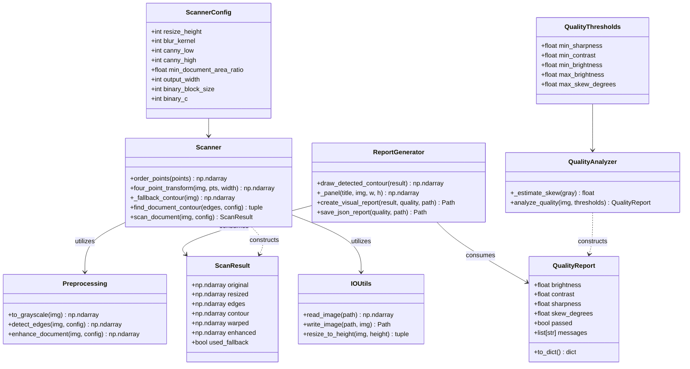

# Class & Component Diagram

```mermaid
classDiagram
    class ScannerConfig {
        +int resize_height
        +int blur_kernel
        +int canny_low
        +int canny_high
        +float min_document_area_ratio
        +int output_width
        +int binary_block_size
        +int binary_c
    }

    class QualityThresholds {
        +float min_sharpness
        +float min_contrast
        +float min_brightness
        +float max_brightness
        +float max_skew_degrees
    }

    class ScanResult {
        +np.ndarray original
        +np.ndarray resized
        +np.ndarray edges
        +np.ndarray contour
        +np.ndarray warped
        +np.ndarray enhanced
        +bool used_fallback
    }

    class QualityReport {
        +float brightness
        +float contrast
        +float sharpness
        +float skew_degrees
        +bool passed
        +list[str] messages
        +to_dict() dict
    }

    class IOUtils {
        +read_image(path) np.ndarray
        +write_image(path, img) Path
        +resize_to_height(img, height) tuple
    }

    class Preprocessing {
        +to_grayscale(img) np.ndarray
        +detect_edges(img, config) np.ndarray
        +enhance_document(img, config) np.ndarray
    }

    class Scanner {
        +order_points(points) np.ndarray
        +four_point_transform(img, pts, width) np.ndarray
        +_fallback_contour(img) np.ndarray
        +find_document_contour(edges, config) tuple
        +scan_document(img, config) ScanResult
    }

    class QualityAnalyzer {
        +_estimate_skew(gray) float
        +analyze_quality(img, thresholds) QualityReport
    }

    class ReportGenerator {
        +draw_detected_contour(result) np.ndarray
        +_panel(title, img, w, h) np.ndarray
        +create_visual_report(result, quality, path) Path
        +save_json_report(quality, path) Path
    }

    ScannerConfig --> Scanner
    QualityThresholds --> QualityAnalyzer
    Scanner ..> ScanResult : constructs
    QualityAnalyzer ..> QualityReport : constructs
    Scanner --> Preprocessing : utilizes
    Scanner --> IOUtils : utilizes
    ReportGenerator --> ScanResult : consumes
    ReportGenerator --> QualityReport : consumes
```
