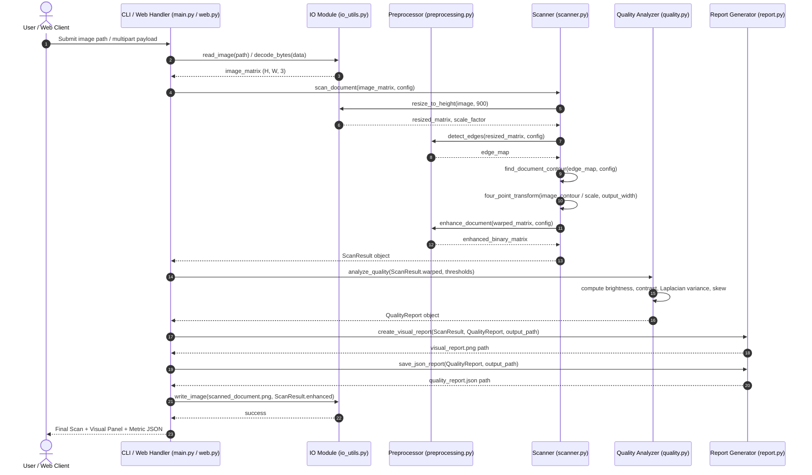

# Sequence Diagram

```mermaid
sequenceDiagram
    autonumber
    actor Client as User / Web Client
    participant Controller as CLI / Web Handler (main.py / web.py)
    participant IO as IO Module (io_utils.py)
    participant Pre as Preprocessor (preprocessing.py)
    participant Scan as Scanner (scanner.py)
    participant Quality as Quality Analyzer (quality.py)
    participant Report as Report Generator (report.py)

    Client->>Controller: Submit image path / multipart payload
    Controller->>IO: read_image(path) / decode_bytes(data)
    IO-->>Controller: image_matrix (H, W, 3)
    
    Controller->>Scan: scan_document(image_matrix, config)
    Scan->>IO: resize_to_height(image, 900)
    IO-->>Scan: resized_matrix, scale_factor
    Scan->>Pre: detect_edges(resized_matrix, config)
    Pre-->>Scan: edge_map
    Scan->>Scan: find_document_contour(edge_map, config)
    Scan->>Scan: four_point_transform(image, contour / scale, output_width)
    Scan->>Pre: enhance_document(warped_matrix, config)
    Pre-->>Scan: enhanced_binary_matrix
    Scan-->>Controller: ScanResult object
    
    Controller->>Quality: analyze_quality(ScanResult.warped, thresholds)
    Quality->>Quality: compute brightness, contrast, Laplacian variance, skew
    Quality-->>Controller: QualityReport object
    
    Controller->>Report: create_visual_report(ScanResult, QualityReport, output_path)
    Report-->>Controller: visual_report.png path
    Controller->>Report: save_json_report(QualityReport, output_path)
    Report-->>Controller: quality_report.json path
    Controller->>IO: write_image(scanned_document.png, ScanResult.enhanced)
    IO-->>Controller: success
    
    Controller-->>Client: Final Scan + Visual Panel + Metric JSON
```
