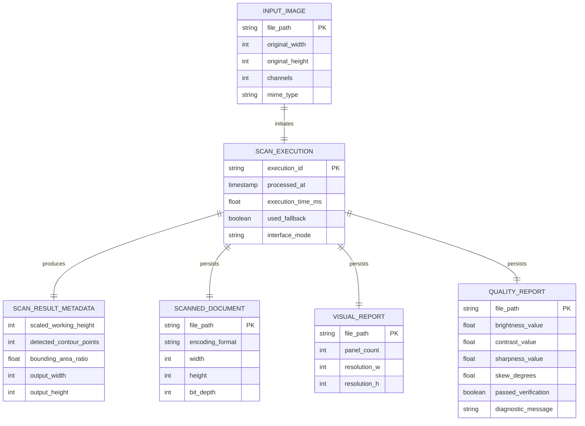

# Storage & ER-Style Diagram

```mermaid
erDiagram
    INPUT_IMAGE ||--|| SCAN_EXECUTION : initiates
    SCAN_EXECUTION ||--|| SCAN_RESULT_METADATA : produces
    SCAN_EXECUTION ||--|| SCANNED_DOCUMENT : persists
    SCAN_EXECUTION ||--|| VISUAL_REPORT : persists
    SCAN_EXECUTION ||--|| QUALITY_REPORT : persists

    INPUT_IMAGE {
        string file_path PK
        int original_width
        int original_height
        int channels
        string mime_type
    }

    SCAN_EXECUTION {
        string execution_id PK
        timestamp processed_at
        float execution_time_ms
        boolean used_fallback
        string interface_mode
    }

    SCAN_RESULT_METADATA {
        int scaled_working_height
        int detected_contour_points
        float bounding_area_ratio
        int output_width
        int output_height
    }

    SCANNED_DOCUMENT {
        string file_path PK
        string encoding_format
        int width
        int height
        int bit_depth
    }

    VISUAL_REPORT {
        string file_path PK
        int panel_count
        int resolution_w
        int resolution_h
    }

    QUALITY_REPORT {
        string file_path PK
        float brightness_value
        float contrast_value
        float sharpness_value
        float skew_degrees
        boolean passed_verification
        string diagnostic_message
    }
```
