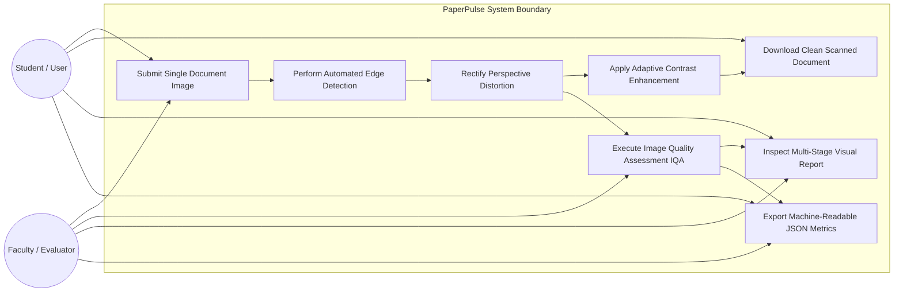

# Use Case Diagram

```mermaid
flowchart LR
    Student((Student / User))
    Faculty((Faculty / Evaluator))

    subgraph PaperPulse_System [PaperPulse System Boundary]
        UC1[Submit Single Document Image]
        UC2[Perform Automated Edge Detection]
        UC3[Rectify Perspective Distortion]
        UC4[Apply Adaptive Contrast Enhancement]
        UC5[Execute Image Quality Assessment IQA]
        UC6[Download Clean Scanned Document]
        UC7[Inspect Multi-Stage Visual Report]
        UC8[Export Machine-Readable JSON Metrics]
    end

    Student --> UC1
    Student --> UC6
    Student --> UC7
    Student --> UC8

    Faculty --> UC1
    Faculty --> UC5
    Faculty --> UC7
    Faculty --> UC8

    UC1 --> UC2
    UC2 --> UC3
    UC3 --> UC4
    UC3 --> UC5
    UC4 --> UC6
    UC5 --> UC7
    UC5 --> UC8
```
