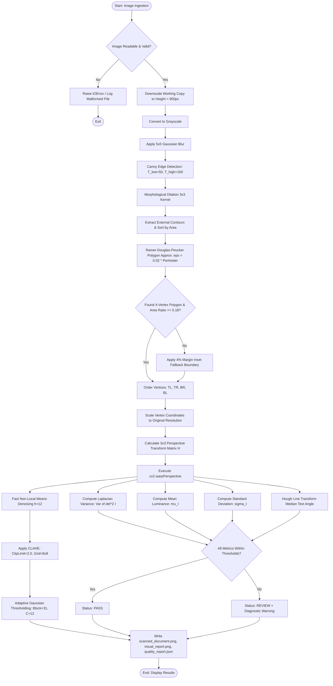

# Workflow Diagram

```mermaid
flowchart TD
    Start([Start: Image Ingestion]) --> ReadCheck{Image Readable & Valid?}
    ReadCheck -- No --> ErrorHandler[Raise IOError / Log Malformed File] --> Terminate([Exit])
    ReadCheck -- Yes --> Resize[Downscale Working Copy to Height = 900px]
    
    Resize --> Gray[Convert to Grayscale]
    Gray --> Blur[Apply 5x5 Gaussian Blur]
    Blur --> Canny[Canny Edge Detection: T_low=50, T_high=160]
    Canny --> Dilate[Morphological Dilation 3x3 Kernel]
    Dilate --> Contours[Extract External Contours & Sort by Area]
    
    Contours --> RDP[Ramer-Douglas-Peucker Polygon Approx: eps = 0.02 * Perimeter]
    RDP --> QuadCheck{Found 4-Vertex Polygon & Area Ratio >= 0.18?}
    
    QuadCheck -- Yes --> CornerSort[Order Vertices: TL, TR, BR, BL]
    QuadCheck -- No --> Fallback[Apply 4% Margin Inset Fallback Boundary]
    Fallback --> CornerSort
    
    CornerSort --> ScaleUp[Scale Vertex Coordinates to Original Resolution]
    ScaleUp --> Homography[Calculate 3x3 Perspective Transform Matrix H]
    Homography --> Warp[Execute cv2.warpPerspective]
    
    Warp --> Denoise[Fast Non-Local Means Denoising h=12]
    Denoise --> CLAHE[Apply CLAHE: ClipLimit=2.0, Grid=8x8]
    CLAHE --> AdaptiveThresh[Adaptive Gaussian Thresholding: Block=31, C=12]
    
    Warp --> CalcSharpness[Compute Laplacian Variance: Var of del^2 I]
    Warp --> CalcBrightness[Compute Mean Luminance: mu_I]
    Warp --> CalcContrast[Compute Standard Deviation: sigma_I]
    Warp --> CalcSkew[Hough Line Transform Median Text Angle]
    
    CalcSharpness & CalcBrightness & CalcContrast & CalcSkew --> EvaluateIQA{All Metrics Within Thresholds?}
    EvaluateIQA -- Yes --> SetPass[Status: PASS]
    EvaluateIQA -- No --> SetReview[Status: REVIEW + Diagnostic Warning]
    
    AdaptiveThresh & SetPass & SetReview --> WriteOutputs[Write scanned_document.png, visual_report.png, quality_report.json]
    WriteOutputs --> End([End: Display Results])
```
